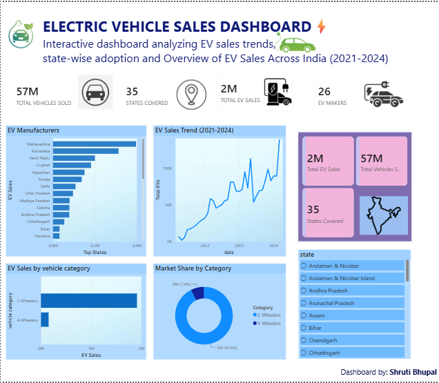

# 🚗 Electric Vehicle Sales Dashboard

## 📌 Project Overview
This Power BI dashboard analyzes Electric Vehicle (EV) sales across India from 2021 to 2024. The dashboard provides insights into EV sales trends, top-performing states, vehicle categories, and overall market performance to support data-driven decision-making.

---

## 🎯 Business Problem
The objective of this project is to analyze India's EV market and identify:

- EV sales growth over time
- Top-performing states
- Vehicle category distribution
- Market trends
- Key performance indicators (KPIs)

---

## 🛠 Tools Used

- Power BI
- Microsoft Excel
- DAX
- Power Query

---

## 📊 Dashboard Preview

> Upload your dashboard screenshot as **dashboard.png** and GitHub will display it automatically.



---

## 📈 Key Performance Indicators

- Total EV Sales
- Total Vehicle Sales
- States Covered
- EV Manufacturers

---

## 📊 Dashboard Features

- EV Sales Trend (2021–2024)
- Top States by EV Sales
- Vehicle Category Analysis
- Market Share Analysis
- Interactive State Filter
- KPI Cards

---

## 💡 Key Insights

- EV sales have shown consistent growth from 2021 to 2024.
- Maharashtra is among the leading states in EV adoption.
- Two-wheelers dominate the Indian EV market.
- Interactive filters allow users to explore state-wise performance.
- The dashboard helps identify market trends and business opportunities.

---

## 📂 Repository Contents

```
EV_Sales_Dashboard.pbix
dashboard.png
README.md
```

---

## 📚 Dataset

This project uses an EV sales dataset provided by **Codebasics** for educational and portfolio purposes.

---

## 👩‍💻 About Me

I'm an aspiring Data Analyst with skills in Power BI, SQL, Excel, and data visualization. I enjoy transforming raw data into meaningful insights and continuously learning new analytical techniques.

Feel free to connect with me on LinkedIn.
